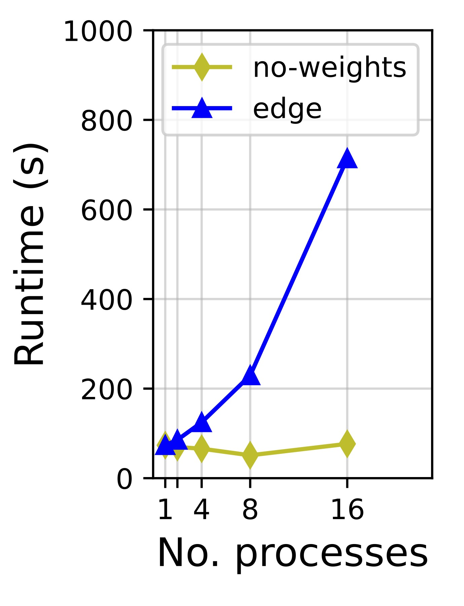
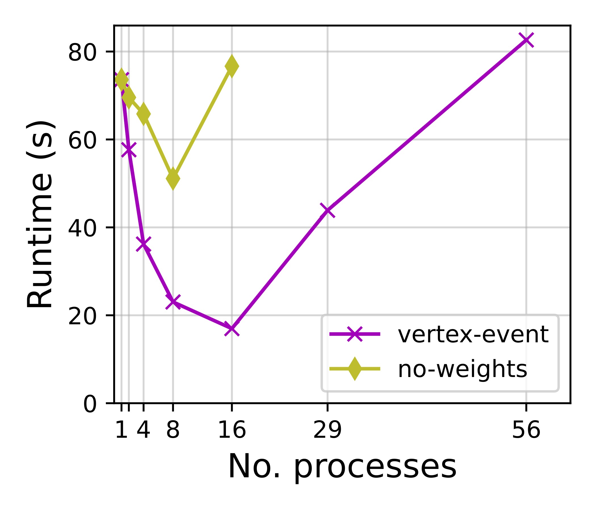
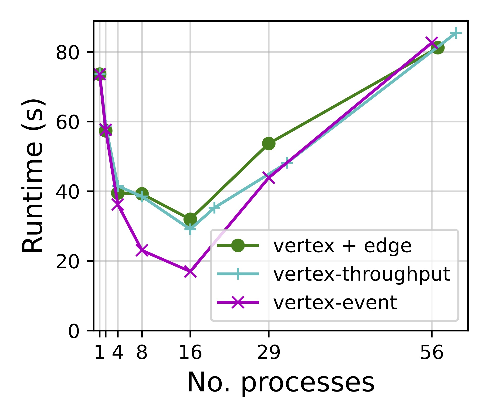

# Introduction

This branch contains the source code and data for the scalability evaluation of **Quaint**.

# Prerequiste

All experiments in this paper were run on a cluster of four DELL PowerEdge T64 servers. Each server has 40 CPU cores (Gold 6230 2.1G*2), 256G RAM, and 1.92TB SSD. All servers are connected via 56Gbps InfiniBand FDR to a Mellanox SX6036 switch. Each server is installed with `Ubuntu 20.04.6 LTS`, `OpenMPI 4.1.6` (required) and `UCX 1.15.0` (optional).

To run the scripts in this branch, make sure to set up a server cluster with similar hardware specs, and write a hostile (see `hostfile-{*}` files in [`experiments/`](experiments)) to specify the information of your cluster.

# Installation

This model requires the installation of [ROSS](http://github.com/carothersc/ROSS):
```bash
cd <YOUR-WORKING-DIRECTORY>
git clone https://github.com/ROSS-org/ROSS.git
mkdir build-ross
cd build-ross

cmake -DCMAKE_INSTALL_PREFIX:path=`pwd` -DCMAKE_C_COMPILER=$(which mpicc) -DCMAKE_CXX_COMPILER=$(which mpicxx) ../ROSS
make install
```

Then clone this project:
```bash
cd .. # should be in <YOUR-WORKING-DIRECTORY>
git clone git@github.com:network-digital-twin/ROSS-Network-Model.git
```

Now run `ls`, your current working directory should contains the following three sub-folders:
```
ROSS  ROSS-Network-Model  build-ross
```

Then checkout to the `experiments-metis` branch:
```bash
cd ROSS-Network-Model
git checkout experiments-metis
```

(Optional) If you place the ROSS build folder (`build-ross`) to a different path from the above instructions, then you need to modify `cmake/FindROSS.cmake` as follows to point to the ROSS build directory. **Otherwise, skip this step.**

Modify the path of `HINTS` in the following lines to point to the build-ross directory.
```cmake
FIND_PATH(WITH_ROSS_PREFIX 
        NAMES include/ross.h
        HINTS "../build-ross"
)
```


Then build the model:
```bash
# now should be in ROSS-Network-Model
mkdir build
cd build
cmake ../
make
```
The executable will be placed in the `build/model` directory.

## Run the simulation

All scripts used to reproduce the results in the paper are contained in [`experiments/`](experiments) 

First unzip the topology data:
```bash
cd ../WL_generation/topologies/
unzip final_topology_0.zip
```

Use `run-*.sh`  to run the experiments:
```bash
cd ../../experiments/
```
There are multiple runner scripts in this folder, which are all named as `run-*.sh`. 
To run one of them as an example: 
```bash
./run-baseline.sh
```
The output will be stored in a new folder named `output/`.  
The detailed statistics of the simulation will be stored in `build/model/ross.csv`

All results have been collected manually to `experiments/results-scalability-*/`.

Specifically, the correspondence between the scripts and the result folders is as follows:

| Script Name                                                              | Result Folder                                                                                                  | Figure Legend       |
|--------------------------------------------------------------------------|----------------------------------------------------------------------------------------------------------------|---------------------|
| [`run-baseline.sh`](experiments/run-baseline.sh)                         | [`results-scalability-metis`](experiments/results-scalability-metis)                                           | `no-weights`        |
| [`run-edge-weights.sh`](experiments/run-edge-weights.sh)                 | [`results-scalability-metis-edge-weights`](experiments/results-scalability-metis-edge-weights)                 | `edge`              |
| [`run-vertex-weights-event.sh`](experiments/run-vertex-weights-event.sh) | [`results-scalability-metis-vertex-weights-event`](experiments/results-scalability-metis-vertex-weights-event) | `vertex-event`      |
| [`run-vertex-weights-pkt.sh`](experiments/run-vertex-weights-pkt.sh)     | [`results-scalability-metis-vertex-weights-pkt`](experiments/results-scalability-metis-vertex-weights-pkt)     | `vertex-throughput` |
| [`run-v-e-weights-pkt.sh`](experiments/run-v-e-weights-pkt.sh)           | [`results-scalability-metis-v-e-weights-pkt`](experiments/results-scalability-metis-v-e-weights-pkt)           | `vertex+edge`       |

<div class="half" style="text-align: center;">



</div>
